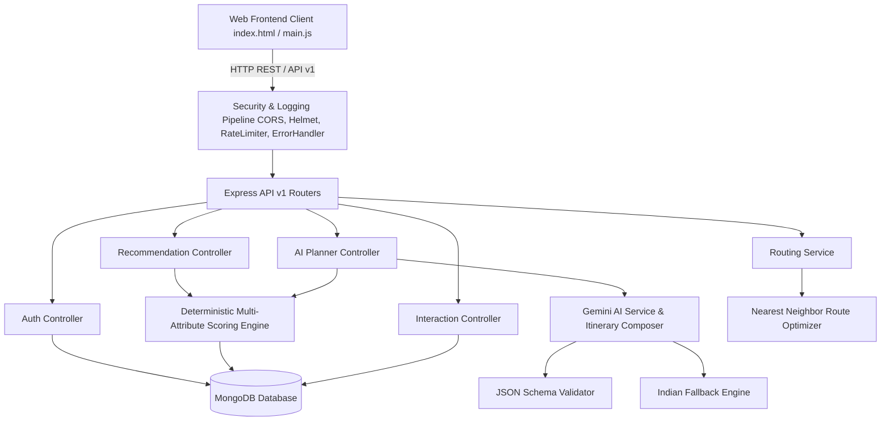

# 🇮🇳 SUVIDHA AI TRAVEL SAATHI

> **SUVIDHA AI TRAVEL SAATHI** is an AI-powered personalized travel discovery and itinerary planning platform that combines recommendation algorithms, generative AI, geospatial routing, structured travel data, and user personalization to create budget-aware travel experiences.

[](https://nodejs.org/)
[](https://expressjs.com/)
[](https://www.mongodb.com/)
[](https://ai.google.dev/)
[](https://leafletjs.com/)
[](#license)

---

## 🏛️ System Architecture

SUVIDHA AI TRAVEL SAATHI is built as a **Modular Monolith** using a layered architecture:



---

## ✨ Key Features

- 🎯 **Deterministic Multi-Attribute Recommendation Engine**: Evaluates and ranks travel destinations based on vibe, budget proximity, duration fit, group type, seasonal alignment, food options, popularity, and traveler ratings without depending on AI.
- 🤖 **Google Gemini AI Itinerary Composer**: Generates day-by-day travel plans, activities, and travel tips using structured candidate destination context.
- 🛡️ **100% Resilient Fallback Engine**: Offline-capable fallback system that creates structured itineraries even if Gemini AI is unconfigured or timed out.
- 🚗 **Geospatial Route Optimization**: Uses Haversine distance and Nearest-Neighbor heuristics to sequence daily activities, eliminating backtracking and estimating commute times & costs.
- 🗺️ **Interactive OpenStreetMap Visualization**: Leaflet map featuring numbered markers (`1`, `2`, `3`, `4`), dashed polylines, category color coding, and interactive day selector tabs (`Day 1 Route`, `Day 2 Route`).
- 👤 **Behavioral Personalization**: Tracks user interactions (`destination_click`, `wishlist_add`, `trip_generated`) to infer favorite vibes and apply a subtle 15% preference boost to future recommendations.
- 👑 **SUVIDHA Partner Booking Suite**: Direct 1-click booking shortcuts for Ola, Uber, Rapido, Swiggy, Zomato, MakeMyTrip, RedBus, and IRCTC.
- 🔒 **Production-Grade Security**: Dual-token JWT auth (15m access / 7d refresh), Helmet security headers, CORS origin whitelisting, 10kb payload limits, and rate limiters.

---

## 🛠️ Tech Stack

- **Backend Runtime**: Node.js (v18+) & Express.js
- **Database & ODM**: MongoDB & Mongoose v8
- **AI & LLM**: Google Gemini API (`gemini-1.5-flash` via `@google/generative-ai`)
- **Geospatial & Maps**: Leaflet.js v1.9 & OpenStreetMap Tiles
- **Security & Utilities**: `jsonwebtoken`, `bcryptjs`, `helmet`, `express-rate-limit`, `cors`, `dotenv`
- **Testing**: Native Node.js HTTP integration test runner (`tests/apiTests.js`)

---

## 📁 Folder Structure

```text
travel-recommendation-app/
├── public/                    # Frontend Client Assets
│   ├── css/
│   │   └── styles.css         # Glassmorphism Design System Stylesheet
│   ├── js/
│   │   └── main.js            # SPA Client Application & Map Script
│   └── index.html             # Main Single Page Interface
├── src/
│   ├── config/
│   │   ├── db.js              # Mongoose Connection Setup
│   │   └── env.js             # Environment Config & Validation
│   ├── controllers/           # Slim Controllers
│   │   ├── aiPlannerController.js
│   │   ├── authController.js
│   │   ├── destinationController.js
│   │   ├── healthController.js
│   │   ├── interactionController.js
│   │   ├── recommendationController.js
│   │   └── subscriptionController.js
│   ├── middleware/            # Pipeline Middlewares
│   │   ├── authMiddleware.js  # JWT Authorization & Resource Ownership
│   │   ├── errorHandler.js    # Global Express Error Handler
│   │   ├── logger.js          # Redacted Structured Request Logger
│   │   ├── rateLimiter.js     # Express Rate Limiters
│   │   └── validate.js        # Declarative Input Validation
│   ├── models/                # Mongoose Database Schemas & Indexes
│   │   ├── Destination.js
│   │   ├── Interaction.js
│   │   ├── Trip.js
│   │   └── User.js
│   ├── routes/
│   │   ├── v1/                # Version 1 Root Router Mount
│   │   │   └── index.js
│   │   ├── aiPlannerRoutes.js
│   │   ├── authRoutes.js
│   │   ├── destinationRoutes.js
│   │   ├── interactionRoutes.js
│   │   ├── recommendationRoutes.js
│   │   └── subscriptionRoutes.js
│   ├── services/              # Business Logic & Algorithms
│   │   ├── ai/
│   │   │   ├── geminiService.js
│   │   │   └── itineraryValidator.js
│   │   ├── maps/
│   │   │   └── routingService.js
│   │   ├── geminiService.js   # Legacy Bridge Export
│   │   └── recommendationService.js
│   └── utils/
│       ├── appError.js        # Specialized Operational AppError Classes
│       └── seeder.js          # Non-Destructive Database Seeder
├── tests/
│   └── apiTests.js            # Automated API Integration Test Suite
├── .env.example               # Environment Variables Template
├── package.json
└── README.md
```

---

## ⚡ Installation & Local Setup

### Prerequisites
- Node.js (v18 or higher)
- MongoDB Server running locally on `mongodb://127.0.0.1:27017` or MongoDB Atlas URI.

### Step 1: Clone Repository & Install Dependencies
```bash
git clone https://github.com/Chaitanya0210/SUVIDHA-AI-TRAVEL-SAATHI.git
cd SUVIDHA-AI-TRAVEL-SAATHI
npm install
```

### Step 2: Configure Environment Variables
Copy `.env.example` to `.env`:
```bash
cp .env.example .env
```
Edit `.env` with your settings:
```env
PORT=5000
NODE_ENV=development
MONGO_URI=mongodb://127.0.0.1:27017/travel_recommendation_db
JWT_SECRET=your_secure_jwt_access_secret_here
JWT_EXPIRES_IN=15m
JWT_REFRESH_SECRET=your_secure_jwt_refresh_secret_here
JWT_REFRESH_EXPIRES_IN=7d
GEMINI_API_KEY=your_optional_gemini_api_key_here
FRONTEND_URL=http://localhost:5000
```

### Step 3: Run Server
```bash
# Start server in production mode
npm start

# Start server in development mode with nodemon
npm run dev
```

The application will be accessible at: `http://localhost:5000`

### Step 4: Run Automated Tests
```bash
npm test
```

---

## 🌐 API Documentation

### 1. Health Checks
- **`GET /api/v1/health`**
  - **Description**: Returns application status, database readiness, and AI engine state.
  - **Response**:
    ```json
    {
      "success": true,
      "status": "UP",
      "checks": {
        "liveness": "UP",
        "readiness": "READY",
        "database": "connected",
        "aiEngine": "fallback_engine_active"
      }
    }
    ```

### 2. Personalized Recommendations Engine
- **`POST /api/v1/recommendations`**
  - **Payload**:
    ```json
    {
      "budget": 20000,
      "duration": 4,
      "group": "couple",
      "vibes": ["nature", "adventure"],
      "sort": "match"
    }
    ```
  - **Response**: Returns ranked candidate destinations with component score breakdowns and explainable match rationale.

### 3. AI Itinerary Planner
- **`POST /api/v1/ai-planner/generate-plan`**
  - **Payload**:
    ```json
    {
      "destination": "Manali",
      "durationDays": 3,
      "budgetLevel": "Standard",
      "travelVibe": "Himalayan Trek",
      "groupType": "Couple"
    }
    ```
  - **Response**: Returns structured day-by-day activities, estimated cost breakdown, travel tips, and geospatial route metrics.

### 4. User Interaction Tracking
- **`POST /api/v1/interactions`**
  - **Payload**: `{ "action": "wishlist_add", "destinationName": "Manali", "metadata": { "vibe": "Nature" } }`

---

## 🧮 Recommendation Scoring Algorithm

Destination match scores (0–99%) are computed deterministically using a multi-attribute weighted component formula:

```javascript
const ComponentWeights = {
  vibe: 0.30,       // 30% - Travel vibe overlap
  budget: 0.20,     // 20% - Budget proximity & daily cost fit
  duration: 0.15,   // 15% - Ideal trip duration match
  group: 0.10,      // 10% - Suitability for group type
  season: 0.10,     // 10% - Best season fit
  food: 0.05,       // 5%  - Food options fit
  popularity: 0.05, // 5%  - Popularity index
  rating: 0.05      // 5%  - Traveler rating
};
```

Final scores blend current explicit user preferences (85% weight) with historical interaction trends (15% weight):

$$\text{FinalScore} = (\text{ExplicitScore} \times 0.85) + (\text{PersonalizationScore} \times 0.15)$$

---

## 🔒 Security & Validation

- **Helmet Security Headers**: Configured to restrict dangerous headers while permitting Leaflet OpenStreetMap CDN scripts & tiles.
- **Strict Input Validation**: Pre-validates all incoming API bodies (`validateRegisterInput`, `validateAiPlannerInput`, `validateDestinationsQuery`).
- **Rate Limiters**:
  - `authLimiter`: 15 requests per 15 mins for `/api/v1/auth/*`
  - `aiLimiter`: 10 requests per 15 mins for `/api/v1/ai-planner/generate-plan`
  - `apiLimiter`: 100 requests per 15 mins for general APIs
- **Payload Size Guards**: Rejects payloads exceeding `10kb`.

---

## 🚀 Deployment Instructions

### Option A: Render / Railway / Heroku
1. Push your repository to GitHub.
2. Create a new Web Service on Render / Railway pointing to your repository.
3. Build Command: `npm install`
4. Start Command: `node src/server.js`
5. Configure Environment Variables in your cloud dashboard (`NODE_ENV=production`, `MONGO_URI`, `JWT_SECRET`, etc.).

### Option B: MongoDB Atlas Setup
1. Create a cluster on MongoDB Atlas.
2. Set your `MONGO_URI` environment variable to `mongodb+srv://<username>:<password>@cluster.mongodb.net/travel_db`.

---

## ⚠️ Remaining Limitations

- **Offline Transport Schedules**: Transport advice (IRCTC, State buses) is estimated based on average speed heuristics and structured database daily costs rather than live real-time API integrations.
- **Single Currency**: Currently optimized exclusively for Indian Rupees (₹ / INR).

---

## 🔮 Future Roadmap

- 🤖 **ML Ranking Model**: Machine learning re-ranking model (XGBoost / LightGBM) trained on interaction logs.
- 🌤️ **Live Weather Integration**: Dynamic itinerary adjustments based on seasonal rainfall and snow predictions.
- 🚆 **Real-time IRCTC API Integration**: Live train availability and seat booking status.

---

## 📜 License

This project is licensed under the ISC License.
